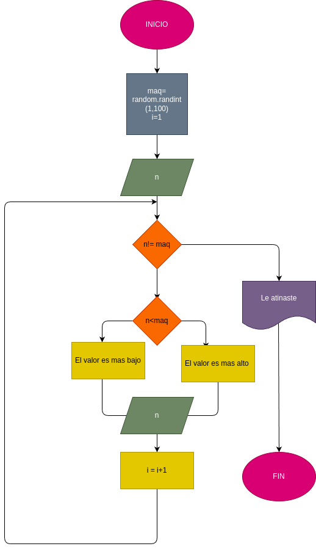

# Juego_1
Adivina el nùmero entre 1 al 100

### Variables dde entrada 
n: nùmero que desea ingresar 

### processing 
maq: La computadora genera un nùmero aleatorio entre 1 y 100

i: Lleva el controlde la cantidad de intentos del usuario 

mientras n < maq:

Si el nùmero ingresado es menor que el nùmero generado, el programa indica que el nùmero a adivinar es mayor.
Si el nùmero ingresado es mayor que el nùmero generado, el programa indica que el nùmero a adivinar es menor.
Volver a pedir un valor y suma 1 intento.

### output 
Depende el resultado sera la respuesta 

### diseño 

### construcciòn 
